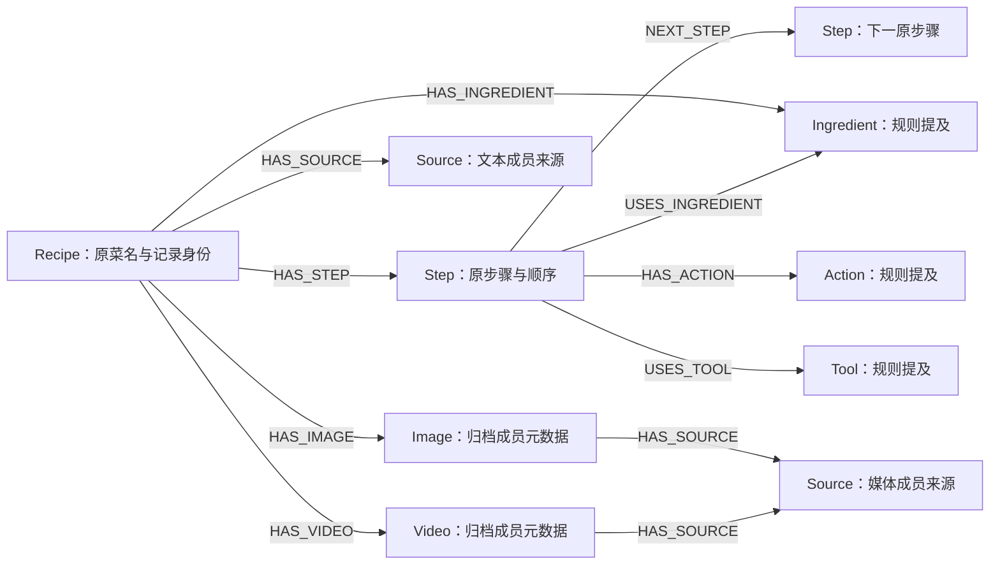
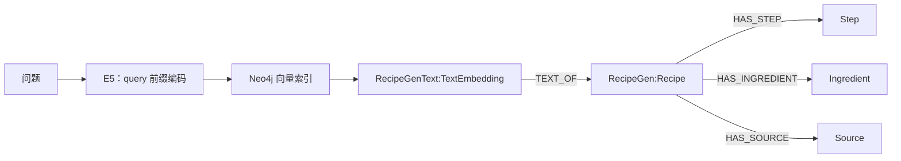
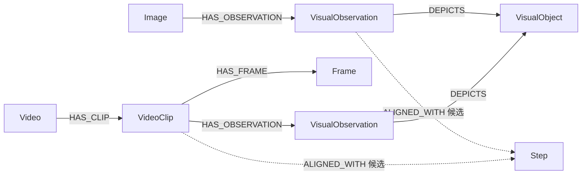

# RecipeGen 图谱 Schema

真实测试图谱按三类保存：**来源原文与目录结构、规则或模型候选、派生检索向量**。下面的关系名称来自构建与检索代码；图只展示主要关系，不代表每条记录都存在全部节点。

## 基础图谱

| 节点 | 关键属性 | 含义 |
|---|---|---|
| `Recipe` | `recipe_id`、`title`、`origin_archive`、`recipe_directory`、`text_complete` | 按归档来源保留的记录，未跨归档去重 |
| `Step` | `step_id`、`recipe_id`、`order`、`text`、`source_id` | 原步骤的非空行；`source_id` 指向原 `steps.txt` 来源 |
| `Ingredient` / `Action` / `Tool` | `name`、`normalized_name`、`zh_name`、`extraction_method` | 词典与规则抽取的概念候选 |
| `Image` / `Video` | `media_id`、`archive`、`member`、`size_bytes`、`crc32`、`source_id` | 原归档成员身份；成员清点不证明负载已下载或识别 |
| `Source` | `source_id`、`dataset`、`archive`、`member`、`artifact_path`、`url`，文本可有 `sha256` | 指向固定数据版本及归档成员的来源 |

公共标签为 `RecipeGen`，再附业务标签，如 `:RecipeGen:Recipe`。导入增加 `kg_csv_id`、`kg_import_namespace` 等身份字段；基础范围由 `build_id`、`dataset_revision`、`split='test'` 限定。`RecipeGenBuild` 管理构建状态，应用只读取唯一的 active、verified 构建。

`NEXT_STEP` 是文本顺序，不能解释为视频时间轴。`HAS_IMAGE` / `HAS_VIDEO` 记录 `directory_membership_only`，目录关联不能证明媒体展示某一步。食材／动作／工具提及关系保留 `semantics='text_mention_candidate'`、`verified=false` 和原文跨度证据；食材列表并不完整。时间和温度命中保存在步骤属性中，未从局部时间推算整道菜总用时。

## 文本 GraphRAG 派生索引

每条食谱一个 `RecipeGenText:TextEmbedding` 节点。`text` 是原菜名与全部有序步骤拼接；`embedding` 是固定 E5 模型得到的 384 维归一化向量。它还保存：

- `source_recipe_id`、`build_id`、`dataset_revision`、`split`：绑定原记录与数据范围。
- `embedding_model`、`embedding_revision`、`index_signature`：绑定模型与编码配置。
- `text_sha256`、`token_count`、`truncated`、`max_tokens`：绑定完整原文，并披露 512 token 截断。
- `kg_import_namespace='recipegen-text-v1'`、`semantics='derived_text_embedding'`：与基础事实分开保存。

`TEXT_OF` 只连接同一已验证构建中的 Recipe。`VectorCypherRetriever` 通过固定关系展开步骤、规则食材和来源；程序回读原文和 ID 集合，并核验全文哈希。相似度用于召回排序，不是正确率或概率。检索与 RRF 方法见 [GraphRAG 设计](GraphRAG设计.md)。

## 可选多模态扩展

扩展使用 `recipegen-mm-v1` 独立命名空间和运行身份，追加 `VisualObservation`、`VisualObject`、`VideoClip`、`Frame`、`SemanticRun`，不改写原始事实。观察记录模型版本、原输出、向量与真实媒体 Source；窗口、帧保留实际时间戳及哈希。`DEPICTS`、`SHOWS_ACTION`、`ALIGNED_WITH` 和空间关系是模型候选；结构／来源回读通过不证明语义正确。

当前图片和视频批处理已停止，未完成全量多模态识别。源码仓库不附媒体和观察检查点，重建基础图谱与文本检索不要求运行该扩展。历史方法见 [多模态语义处理](多模态语义处理.md)，历史验收范围见 [发布验收摘要](../reports/发布验收.md)。
